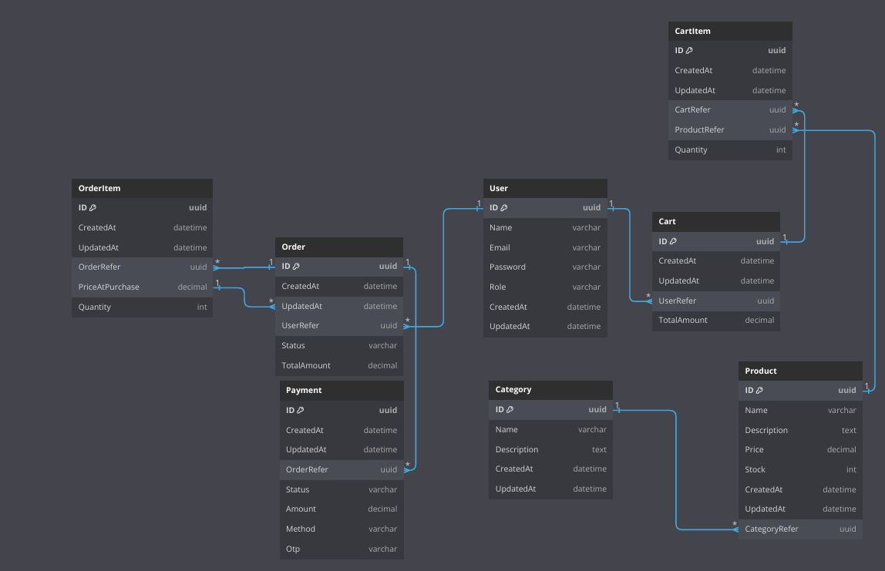

# Go Fiber Online Store Rest API

A Simple Online Store REST API build with Golang Fiber, GORM, and Postgres

## Table of Contents

- [Installation](#installation)
- [Usage](#usage)
- [Configuration](#configuration)
- [ERD](#erd)
- [Endpoints](#endpoints)

## Installation

1. Clone the repository:
   ```
   git clone https://github.com/arsyaputraa/go-synapsis-challenge.git
   ```
2. Navigate into the project directory:
   ```
   cd ~~/go-synapsis-challenge
   ```
3. Install dependencies:

   ```
   go mod download
   ```

   ## Usage

4. Copy the example configuration file:

   ```
   cp .env.example .env
   ```

5. Edit the `.env` file to include your configuration settings.
6. Run the server:

   ```
   go run main.go
   ```

   or use Air

   ```
   air
   ```

   The API will start on `http://localhost:8080`.

## Configuration

- `JWT_SECRET_KEY`: jwt secret key
- `DB_HOST`:The hostname of the database server.
- `DB_PORT`:The database port.
- `DB_USER`:The database user.
- `DB_PASSWORD`:The password for the database user.
- `DB_NAME`:The database name

## ERD



## API Endpoint Documentation

This documentation provides brief information about each API endpoint in the application, explaining their functionality.

### Table of Contents

- [Admin Endpoints](#admin-endpoints)
- [Authentication Endpoints](#authentication-endpoints)
- [Cart Endpoints](#cart-endpoints)
- [Category Endpoints](#category-endpoints)
- [Order Endpoints](#order-endpoints)
- [Product Endpoints](#product-endpoints)
- [User Endpoints](#user-endpoints)
- [Webhook Endpoints](#webhook-endpoints)

### Admin Endpoints

Endpoints for managing products and categories. Only accessible by users with an "admin" role and require JWT authentication.

#### 1. `POST /api/admin/product`

- **Description**: Adds a new product to the database.

#### 2. `PATCH /api/admin/product/:id`

- **Description**: Updates an existing product by its ID.

#### 3. `DELETE /api/admin/product/:id`

- **Description**: Deletes an existing product by its ID.

#### 4. `POST /api/admin/category`

- **Description**: Adds a new category.

#### 5. `PATCH /api/admin/category/:id`

- **Description**: Updates an existing category by its ID.

#### 6. `DELETE /api/admin/category/:id`

- **Description**: Deletes an existing category by its ID.

### Authentication Endpoints

Endpoints for user registration and login.

#### 1. `POST /api/auth/register`

- **Description**: Registers a new user account.

#### 2. `POST /api/auth/login`

- **Description**: Authenticates a user and returns a JWT token.

### Cart Endpoints

Endpoints for managing the shopping cart. Require JWT authentication.

#### 1. `POST /api/cart/`

- **Description**: Adds an item to the user's cart.

#### 2. `GET /api/cart/`

- **Description**: Retrieves all items in the user's cart.

#### 3. `GET /api/cart/:id`

- **Description**: Retrieves a specific cart item by its ID.

#### 4. `DELETE /api/cart/:id`

- **Description**: Removes a specific item from the cart by its ID.

### Category Endpoints

Endpoints for retrieving category information.

#### 1. `GET /api/category/`

- **Description**: Retrieves a list of all categories.

### Order Endpoints

Endpoints for processing orders. Require JWT authentication.

#### 1. `POST /api/order/checkout`

- **Description**: Checks out the user's cart and creates an order.

#### 2. `GET /api/order/`

- **Description**: Retrieves all orders for the authenticated user.

### Product Endpoints

Endpoints for retrieving product information.

#### 1. `GET /api/product/`

- **Description**: Retrieves a list of all products.

#### 2. `GET /api/product/:id`

- **Description**: Retrieves detailed information about a specific product by its ID.

### User Endpoints

Endpoints for user profile management. Require JWT authentication.

#### 1. `GET /api/user/me`

- **Description**: Retrieves the authenticated user's profile.

#### 2. `PATCH /api/user/update`

- **Description**: Updates the authenticated user's profile information.

#### 3. `PATCH /api/user/change-password`

- **Description**: Changes the authenticated user's password.

### Webhook Endpoints

Endpoints for handling webhooks.

#### 1. `GET /api/webhook/payment`

- **Description**: Handles payment webhook notifications.
